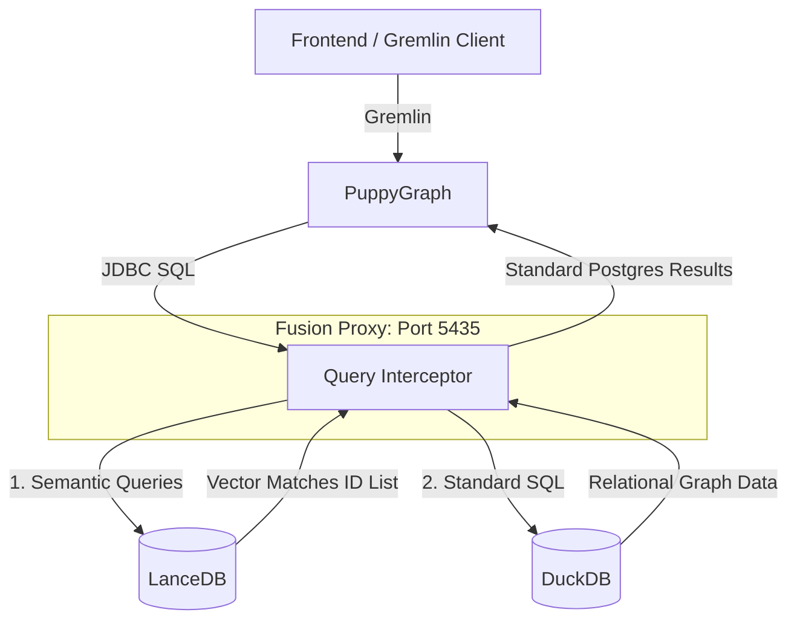

# LanceDB + PuppyGraph: Semantic Graph Connector

This repository contains **FusionProxy**—a custom connector that seamlessly integrates **PuppyGraph** (high-performance graph traversal) with **LanceDB** (semantic vector search).

PuppyGraph natively connects to relational databases via JDBC. This project provides a proxy that masquerades as a PostgreSQL server. It allows PuppyGraph to traverse relationships stored in DuckDB while routing any semantic search queries directly to LanceDB's vector index.

---

## 🏗 Architecture



### The Core of the Proxy

The heart of this repository is `fusion_proxy.py`. 

PuppyGraph uses the Postgres wire protocol to execute SQL queries. The proxy (built using `buenavista`) intercepts these queries *before* they reach the database.

It listens for a custom SQL macro: `vec_search(table_name, 'search_string', limit)`.
When the proxy spots this macro in a WHERE clause, it:
1. Strips the macro from the SQL string.
2. Embeds the `'search_string'` using a sentence transformer model.
3. Queries LanceDB to instantly find the top `limit` mathematically closest vectors.
4. Extracts the IDs of those vectors and **rewrites the SQL query** on the fly to use a standard `IN ('id1', 'id2', ...)` clause.
5. Passes the newly rewritten standard SQL query to DuckDB to retrieve the relational data.
6. Returns the data to PuppyGraph.

To PuppyGraph, it feels exactly like querying a standard Postgres database, but you get blazing-fast vector similarity search built directly into the SQL layer.

---

## 🎬 Walkthrough: The Movie Example

Inside the `examples/movies` directory is a complete, end-to-end Graph Discovery Engine.

It solves a specific problem: **Vector search finds meaning, but Graph traversal uncovers creative DNA.**

### The Flow
1. **Semantic Matches (LanceDB):** A user searches for *"brooding psychological thriller"*. LanceDB converts this text into a vector, scans its index of movie plot descriptions, and returns the top 18 matches.
2. **Shared Creators (PuppyGraph):** We send those 18 movie IDs to PuppyGraph via Gremlin. PuppyGraph traverses the `FEATURES` (Actors) and `PRODUCED_BY` (Producers) edges. It runs a `groupCount()` to find out which creators appear most frequently in this semantic cluster, filtering by a strict "signal strength" threshold against their entire career catalog.
3. **Graph Discoveries (PuppyGraph + LanceDB):** PuppyGraph hops from those top creators to their *other* films (films that were completely missed by the initial vector search). LanceDB re-scores these new films to ensure semantic relevance, and surfaces them as hidden gems.

---

## ⚙️ Setup & Connection

### 1. The PuppyGraph Schema
Because we use the Fusion Proxy, configuring PuppyGraph is incredibly simple. In `examples/movies/schema.json`, we configure PuppyGraph to point to the proxy via JDBC:

```json
"catalogs": [
  {
    "name": "movies",
    "type": "postgresql",
    "jdbc": {
      "username": "postgres",
      "password": "postgres",
      "jdbcUri": "jdbc:postgresql://host.docker.internal:5435/movies?ssl=false&sslmode=disable",
      "driverClass": "org.postgresql.Driver"
    }
  }
]
```

The schema defines standard vertices and edges pulling straight from the DuckDB tables via the proxy:
* **Vertices:** `Movie`, `Actor`, `Producer`
* **Edges:** `FEATURES` (Movie → Actor), `PRODUCED_BY` (Movie → Producer)

### 2. Start PuppyGraph
```bash
docker compose up -d
```
PuppyGraph is available at `http://localhost:8085` (Login: `puppygraph` / `puppygraph123`).

### 3. Start the Proxy
The proxy requires a path to the DuckDB relational file and the LanceDB vector directory (defined in `config.yaml`).
```bash
python fusion_proxy.py --config examples/movies/config.yaml
```

### 4. Upload Schema & Run the UI
Push the schema to PuppyGraph:
```bash
curl -XPOST -H "content-type: application/json" \
     --data-binary @examples/movies/schema.json \
     --user "puppygraph:puppygraph123" \
     localhost:8085/schema
```

Start the frontend Graph Discovery Engine:
```bash
cd examples/movies
python demo_server.py
```
Open `http://localhost:8052`.
