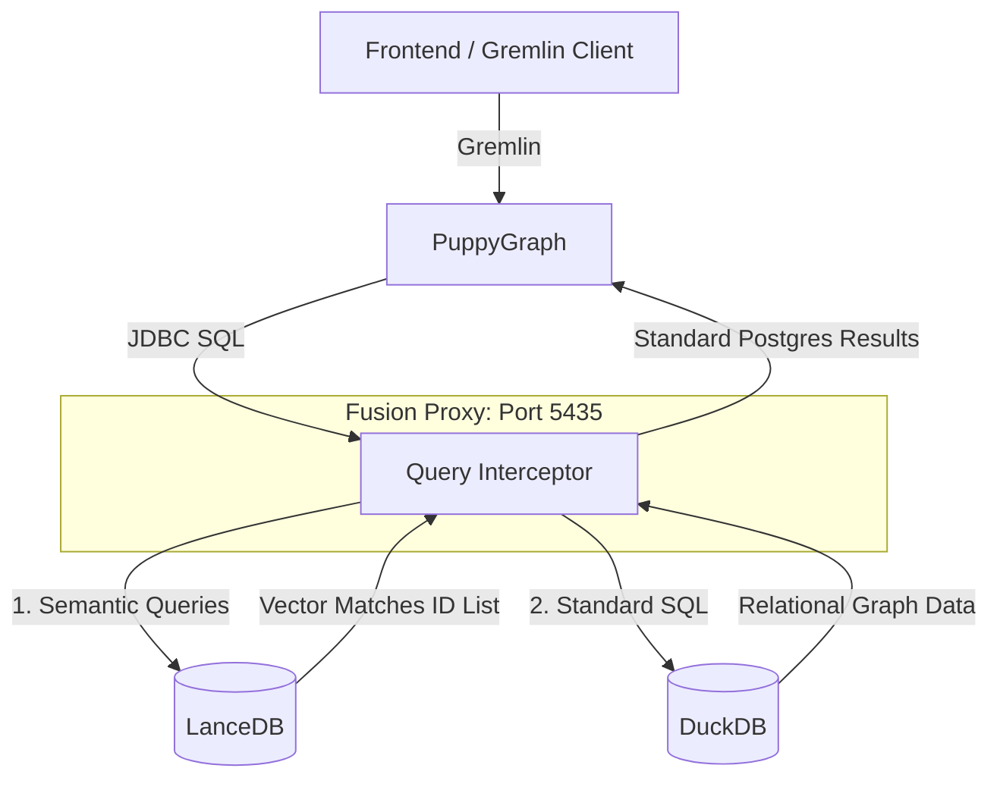
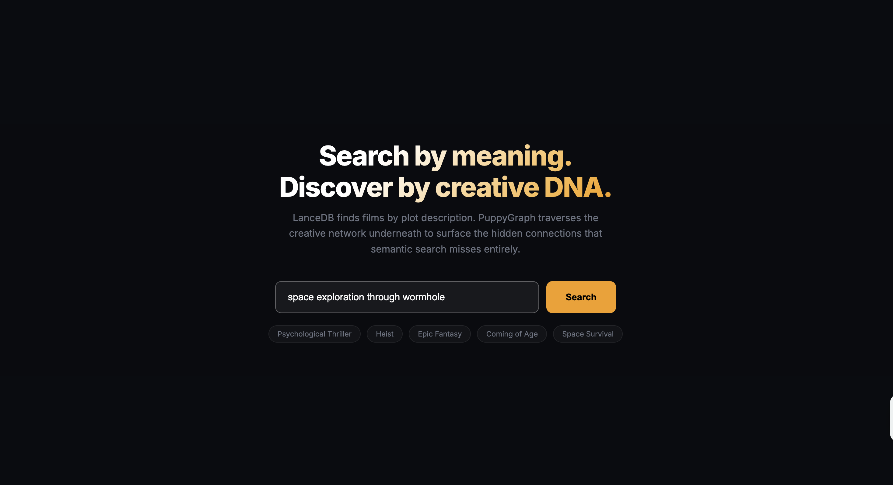
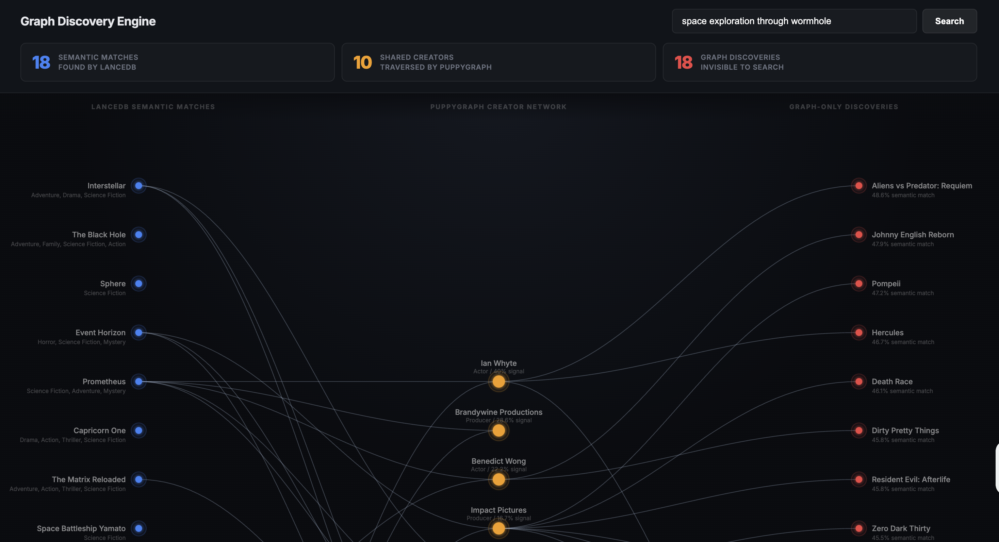
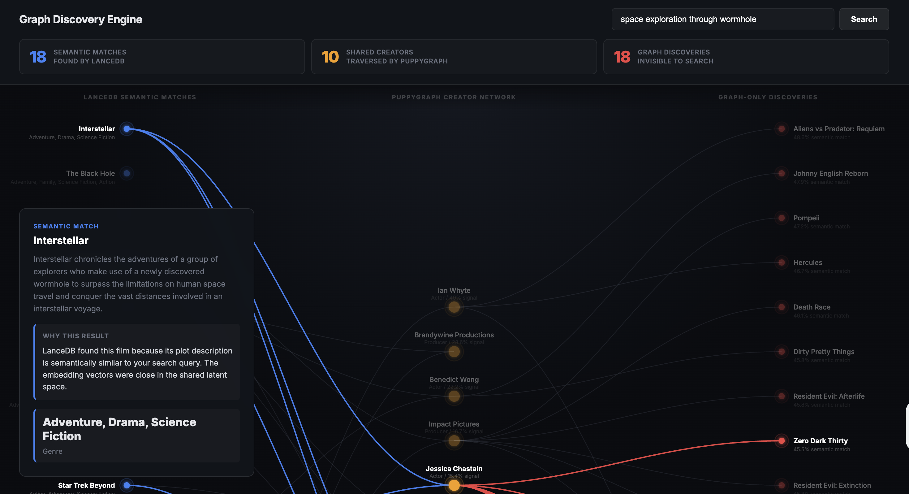
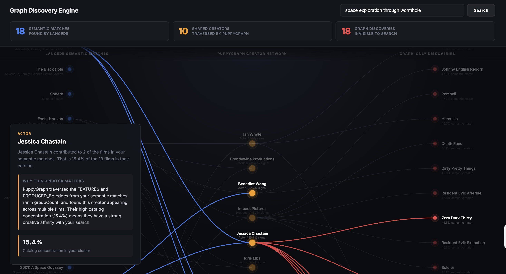
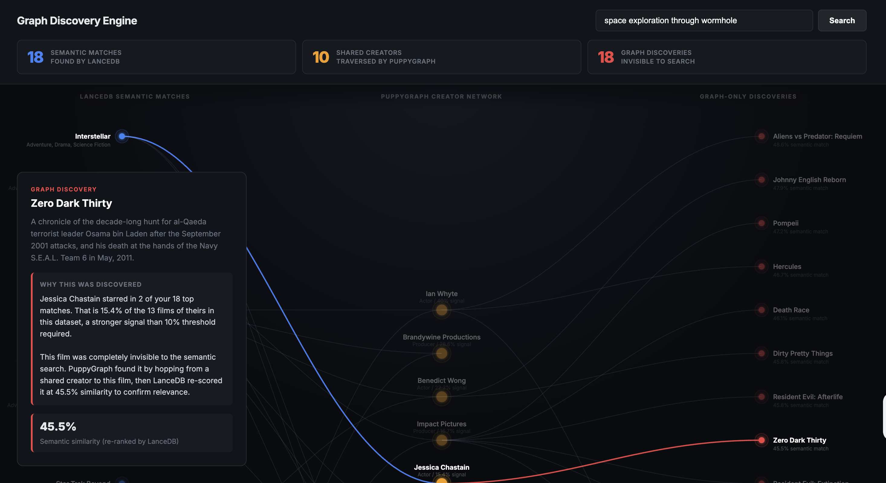

# LanceDB + PuppyGraph

Semantic vector search and graph traversal, connected through DuckDB.

LanceDB finds films by meaning. PuppyGraph follows creator relationships to reach films that meaning-based search cannot see. The two are connected through a DuckDB bridge that lets PuppyGraph treat LanceDB as just another table it can query.

---

## The Problem This Solves

Semantic search is good at finding things that *sound* similar. It fails at finding things that are *connected* without describing themselves that way.

A query like "brooding psychological thriller" will surface Inception, Memento, and Fight Club. It will not surface The Prestige, because The Prestige's plot description does not strongly overlap the query vector. But the same director made it. The same production company financed it. The same actors appeared in it.

PuppyGraph closes that gap. It traverses the graph from the films semantic search *did* find, identifies creators with unusually high concentration in that cluster, and hops to their other work. LanceDB then re-ranks those graph finds by actual similarity to the query, so only genuinely relevant films surface.

Neither tool alone does this. LanceDB without the graph misses The Prestige. PuppyGraph without LanceDB cannot identify which starting point is meaningful.

---

## Why DuckDB

PuppyGraph connects to storage via JDBC. DuckDB has a JDBC driver, runs in-process with no server, and stores data in a single file. That combination makes it the lowest-friction choice for a demo that needs to run locally without infrastructure.

The more important reason: DuckDB has a native LanceDB extension.

The [lance extension for DuckDB](https://lancedb.github.io/lancedb/integrations/duckdb/) surfaces LanceDB tables as virtual SQL tables inside DuckDB. This means you can join graph data against vector similarity results using plain SQL, without maintaining two separate connection pools or writing custom routing logic.

In this project, PuppyGraph connects to DuckDB (through a thin proxy described below). The proxy intercepts a custom `vec_search()` macro in the SQL, runs the actual vector search against LanceDB, and rewrites the query to a standard `IN (id1, id2, ...)` clause before passing it to DuckDB. DuckDB handles all the relational graph data: movies, actors, producers, and the edges between them.

---

## Architecture



## How the Proxy Works

This is the part that matters. The proxy is the reason this project exists.

### The constraint

PuppyGraph connects to data through JDBC. It does not have a plugin API for vector databases. It has no concept of an embedding. If you want PuppyGraph to use LanceDB, you have exactly one option: make LanceDB look like a relational database it already knows how to talk to.

The proxy does that. It pretends to be a PostgreSQL server. PuppyGraph connects to it with the standard `org.postgresql.Driver`, sends standard SQL, and receives standard rows. It has no idea LanceDB is involved.

### The four layers

The proxy is about 200 lines of Python and stacks four things:

1. **Postgres wire protocol** via [buenavista](https://github.com/jwills/buenavista). This handles the TCP socket, the handshake, prepared statements, parameter binding, and the row encoding. PuppyGraph thinks it is talking to Postgres 14.
2. **DuckDB in-memory engine.** All SQL that arrives at the proxy is executed by DuckDB. DuckDB attaches `movies.db` as a catalog so the graph tables (movies, actors, producers, edges) are queryable.
3. **The DuckDB Lance extension.** `INSTALL lance; LOAD lance; ATTACH 'lance_movies' AS lance_ns (TYPE LANCE);` mounts the LanceDB directory as a DuckDB catalog. After this point, LanceDB tables are first-class DuckDB tables. The extension provides `lance_vector_search(table, column, query_vector, k)` which runs the actual ANN search in native code.
4. **A SQL rewriter.** Sits in front of DuckDB. Catches a custom `vec_search()` macro in incoming SQL and rewrites it into a `lance_vector_search()` subquery before DuckDB sees it.

### The critical trick: vec_search()

PuppyGraph's schema lets you define a vertex or edge with a SQL `WHERE` clause. The schema for this project uses:

```sql
WHERE movie_id IN vec_search(movies, 'query text here', 40)
```

That `vec_search` is not a real function. DuckDB has never heard of it. It is a marker that the proxy looks for. When the proxy sees it on the wire, before passing the SQL down to DuckDB it does this:

1. Parse the macro: extract table name, query text, and `k`.
2. Embed the query text in-process using the same `SentenceTransformer` model that was used to build the LanceDB index. Same model, same tokenizer, same dimensionality. If these did not match, similarity scores would be meaningless.
3. Build a vector literal: `[0.013, -0.041, ...]::FLOAT[]`. About 384 floats for `bge-small`.
4. Replace the macro with a real DuckDB subquery:
   ```sql
   IN (SELECT movie_id FROM lance_vector_search(
         'lance_ns.main.movies', 'vector', [...]::FLOAT[], k=40))
   ```
5. Send the rewritten SQL to DuckDB. DuckDB hits the Lance extension, which does the ANN search in native code against the on-disk index, returns the matching IDs, and DuckDB joins those IDs against the graph tables in the same query.

One round-trip. No application-layer join. The vector search and the relational join happen in the same DuckDB execution plan.

### The JDBC compatibility tax

DuckDB is not Postgres. It is close, but PuppyGraph's JDBC driver sends a handful of probes that DuckDB does not answer the way Postgres does. The proxy intercepts these too:

- `SHOW TRANSACTION ISOLATION LEVEL` returns a synthesized `'read committed'` row.
- `SET <anything>` is silently no-ope'd. JDBC sets timezone and client encoding on connect, DuckDB ignores both.
- Some Postgres metadata queries do `INNER JOIN pg_catalog.pg_type` on OIDs that DuckDB does not populate. The proxy rewrites those to `LEFT JOIN` so they do not drop every row.
- `array_upper(current_schemas(false), 1)` is patched to a literal `1` because DuckDB's array function signatures differ.

None of this is interesting. It is the kind of thing you only discover by running PuppyGraph against the proxy, watching the error log, and patching until everything connects. The reason it is in the codebase is because without it the JDBC handshake fails and you never reach the interesting part.

### Why a proxy instead of two databases

The obvious alternative is to skip the proxy: have the application code talk to LanceDB directly for semantic search, get a list of IDs, then send those IDs to PuppyGraph in a Gremlin `g.V(id1, id2, ...)` call.

That works, but it has a real cost. Every vector search becomes two round-trips and a network hop in between. The list of IDs has to be serialized into a Gremlin query string, which gets big fast at `k=500`. And the graph engine cannot push predicates into the vector search, so you cannot say "find me films like X *that are also produced by Y*" in one query.

With the proxy, that is one SQL statement. PuppyGraph emits it, DuckDB plans it, the Lance extension answers the vector part, DuckDB joins the graph part, and PuppyGraph receives rows. The proxy makes the two systems look like one to the graph engine, and that is the entire point.

### Where to look in the code

- `fusion_proxy.py:17` is the regex that catches the macro
- `fusion_proxy.py:46` builds the lance_vector_search subquery
- `fusion_proxy.py:62` is the `execute_sql` interceptor (everything routes through here)
- `fusion_proxy.py:86` does the macro detection and rewrite
- `fusion_proxy.py:179` loads the DuckDB Lance extension on startup

---

## The Movies Demo

The `examples/movies/` directory contains a complete demo: a web UI that shows semantic search results alongside graph-discovered films that semantic search missed.

### What the graph adds

Given a query, the demo:

1. Uses LanceDB to find the top 40 semantically matching films
2. Uses PuppyGraph (Gremlin `groupCount()`) to find which actors and producers appear most in that cluster, measured as a percentage of their total catalog
3. Only follows creators where the cluster overlap is at least 10% of their filmography (the signal threshold that separates meaningful concentration from coincidence)
4. Hops via PuppyGraph from those creators to their other films that fell outside LanceDB's top-500 scan
5. Re-ranks those graph-only films with LanceDB cosine similarity and returns the closest ones

The result is a set of films that are genuinely related by creative lineage, not just by description similarity.

### Bridge films

For each creator the graph surfaces, the UI shows the "bridge films": the cluster films that put that creator on the radar in the first place. This makes the reasoning transparent. You can see exactly which films caused the graph to follow a creator, and which films the graph then found.

The Gremlin query behind each find is shown in the UI:

```
g.V('Producer[syncopy]').in('PRODUCED_BY').id()
  --> returns every movie_id Syncopy produced
  --> bridge films = intersection with your top 40 matches
  --> graph-only = everything not in LanceDB's wider 500-film scan
```

---

## Search Queries That Show the Graph Working

These queries produce strong graph finds in the current dataset (the graph surfaces films that semantic search misses, with clear creator lineage):

| Query | What the graph surfaces |
|---|---|
| `mind bending thriller reality is not what it seems` | Christopher Nolan's catalog via Syncopy; films like The Prestige and Memento that don't match the query description but share creative DNA with Inception |
| `dark psychological drama isolation obsession` | Actors with high cluster concentration (Edward Norton, Russell Crowe) and their other work |
| `heist crew planning elaborate robbery` | Producers whose entire catalog sits in this cluster; graph hops to adjacent crime dramas |
| `superhero reluctant hero chosen destiny` | Production companies that specialize in this genre; reveals films with similar backing but different surface descriptions |
| `violent revenge crime underworld loyalty` | High-signal actors who span this theme across different productions |
| `sci-fi survival colonization space` | Niche producers with focused catalogs; the graph finds everything they made in this space |
| `war brotherhood sacrifice honor` | Chemistry pairs (two actors who always appear together) and their full catalog |

Queries that work best have a focused creative community behind them. Broad genres like "comedy" or "drama" produce low signal because too many unrelated creators share that space. Specific stylistic niches produce high signal because the same people keep making them.

---

## The Demo

### Landing



A search box and a few example chips. The query in the screenshot is `space exploration through wormhole`.

### The graph



Three columns, left to right:

- **18 semantic matches** found by LanceDB (blue nodes): Interstellar, The Black Hole, Sphere, Event Horizon, Prometheus, Capricorn One, The Matrix Reloaded, Space Battleship Yamato, and others
- **10 shared creators** traversed by PuppyGraph (yellow nodes): Brandywine Productions, Impact Pictures, Jessica Chastain, Benedict Wong, Ian Whyte
- **18 graph discoveries** invisible to search (red nodes): Aliens vs Predator Requiem, Pompeii, Hercules, Death Race, Zero Dark Thirty, Resident Evil Afterlife

Edges show which creators bridge which films. Nothing in the right column was returned by LanceDB for this query.

### Clicking a semantic match



Click Interstellar (a film LanceDB found). The blue edges light up to show every creator from the center column who worked on it. The side panel explains what LanceDB matched on: the plot description was close to the query in vector space.

### Clicking a creator



Click Jessica Chastain. She appeared in 2 of the 18 semantic matches, which is 15.4% of her 13-film catalog in this dataset. The panel shows the Gremlin reasoning: PuppyGraph ran `groupCount()` on the FEATURES and PRODUCED_BY edges from the cluster, kept creators above the 10% catalog-concentration threshold, then hopped to their other films.

### Clicking a graph discovery



Click Zero Dark Thirty (on the right). LanceDB never returned this film for `space exploration through wormhole`. The graph reached it through Jessica Chastain (who is in both Interstellar and Zero Dark Thirty). LanceDB then re-scored its plot against the query and returned 45.5% similarity, which is why it surfaces here instead of being noise.

The blue edge (Interstellar to Chastain) and the red edge (Chastain to Zero Dark Thirty) together show the exact two-hop path. This is what the graph adds: a film a vector search cannot find, with a transparent reason for why it belongs.

---

## Setup

### Prerequisites

- Python 3.10+ with a virtual environment
- Docker (for PuppyGraph)
- The `movies.db` and `lance_movies/` data files (built by `examples/movies/load_data.py`)

### 1. Start PuppyGraph

From the repo root:

```bash
docker compose up -d
```

PuppyGraph starts on port 8085. Login: `puppygraph` / `puppygraph123`.

Wait about 30 seconds before proceeding.

### 2. Start the FusionProxy

```bash
source venv/bin/activate
python fusion_proxy.py --config examples/movies/config.yaml
```

The proxy listens on port 5435. Keep this running in a separate terminal.

### 3. Upload the Graph Schema

```bash
curl -XPOST -H "content-type: application/json" \
     --data-binary @examples/movies/schema.json \
     --user "puppygraph:puppygraph123" \
     localhost:8085/schema
```

Expected response: `{"Status":"OK","Message":"Schema updated successfully"}`

The schema defines:

| Vertex | Table |
|---|---|
| `Movie` | `public.movies` |
| `Actor` | `public.actors` |
| `Producer` | `public.producers` |

| Edge | Direction |
|---|---|
| `FEATURES` | Movie to Actor |
| `PRODUCED_BY` | Movie to Producer |

### 4. Start the Demo Server

```bash
cd examples/movies
python demo_server.py
```

Open `http://localhost:8052`.

---

## Graph Schema

PuppyGraph connects to the FusionProxy via JDBC as if it were PostgreSQL:

```json
"catalogs": [
  {
    "name": "movies",
    "type": "postgresql",
    "jdbc": {
      "jdbcUri": "jdbc:postgresql://host.docker.internal:5435/movies?ssl=false&sslmode=disable",
      "username": "postgres",
      "password": "postgres"
    }
  }
]
```

---

## Troubleshooting

**Port 5435 not listening:** The proxy exited. Re-run `python fusion_proxy.py --config examples/movies/config.yaml`. Check that `examples/movies/movies.db` exists.

**Schema upload 404:** Post to port 8085 (not 8081), path `/schema` (not `/api/schema`).

**No graph finds returned:** The query may not have a concentrated creative community behind it. Try a more specific stylistic query, or one from the table above. The signal threshold requires at least 10% catalog overlap.

**First search is slow (3-4 seconds):** The embedding model loads on first request. Subsequent searches are under 200ms.

**DuckDB lock error:** Only one process can hold the DuckDB write lock. Make sure `movies.db` is not open in another terminal.

---

## Repository Structure

```
.
├── fusion_proxy.py          the Postgres-wire bridge (LanceDB + DuckDB backend)
├── docker-compose.yml       PuppyGraph container
├── examples/
│   └── movies/
│       ├── demo_server.py   FastAPI server: /search, /analyze, /discover
│       ├── demo_ui/         browser frontend
│       ├── load_data.py     builds movies.db and lance_movies/ from source data
│       ├── schema.json      PuppyGraph graph schema
│       └── config.yaml      proxy configuration
└── venv/                    Python virtual environment
```
